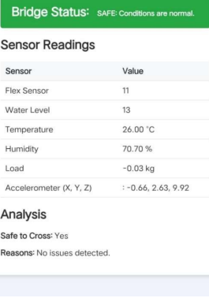

# bridge_monitoring

# IoT-Based Road Bridge Health Monitoring and Warning System

An IoT-enabled project to monitor the structural health of bridges in real-time using multiple sensors, cloud connectivity, and automation to enhance public safety and infrastructure maintenance.

---

## 🔍 Project Overview

This system uses sensors such as **vibration sensors**, **load cells**, **DHT22 (temperature & humidity)**, **MPU6050 (accelerometer/gyroscope)**, **IR sensors**, **water level sensors**, and **flex sensors** to continuously monitor parameters that affect bridge stability. Data is transmitted via **ESP8266 NodeMCU** to a cloud-based dashboard.

In the event of any detected anomaly (e.g., excessive vibration, tilt, water level rise, or load), a **warning system** activates: buzzer alert, LED indicator, and servo-based barrier control.

---

## 🧰 Hardware Used

- **Arduino UNO R3 WiFi**
- **ESP8266 NodeMCU**
- **MPU6050 Accelerometer/Gyroscope**
- **Vibration Sensor**
- **Load Sensor (5kg)**
- **DHT22 Temperature and Humidity Sensor**
- **Water Level Sensor**
- **Flex Sensor**
- **Infrared Sensor**
- **Servo Motor**
- **1KΩ Resistors, LEDs, Buzzer**

---

## 💻 Software & Tools

- **Arduino IDE**
- **Embedded C (Arduino Language)**
- **ESP8266 WebServer Library**
- **Adafruit MPU6050 & DHT Libraries**
- **HX711 Load Cell Library**

---

## 🛠️ System Architecture

- Sensor Data Collection → Arduino UNO R3
- Data Transmission via UART → ESP8266
- ESP8266 Web Server → Real-time Monitoring Dashboard
- Trigger Alerts → Servo (barrier), Buzzer, LEDs

---

## 🌐 Live Monitoring Interface

ESP8266 hosts a local web page displaying:

- Sensor Readings (Temperature, Humidity, Vibration, Tilt, Water Level, etc.)
- Real-time bridge status (SAFE/UNSAFE)
- Alerts and Reason Logs

**Refresh Rate:** 1 second  
**UI:** Responsive, auto-refreshing with CSS styling

---

## 🧪 Functional Features

- Real-time anomaly detection
- Barrier control (Servo motor)
- Automatic LED lighting using LDR
- Audible alerts via buzzer
- Mobile/PC-based web interface

---

## 📊 Example Dashboard Screenshot

> *(Insert image using GitHub image upload or link here)*  
```markdown

